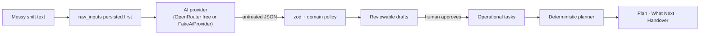

# ShiftPilot

An AI-assisted workload planning system that converts messy natural-language work into
reviewable structured tasks and an explainable deterministic schedule.

**AI interprets. Human verifies. Deterministic software decides.**

Frontline and operational workers dump their shift into a text box — tasks, deadlines,
dependencies, interruptions — and ShiftPilot turns it into an ordered, prioritised,
dependency-aware plan. No hidden decisions: a human reviews every extracted task before it
becomes real, and a deterministic engine (not the AI) does all scheduling arithmetic.

- Week-1 deliverable for the **Innovation Hacks AI Internship 2026**.
- Live external AI is verified on the **OpenRouter free tier** (controlled evaluation,
  `docs/eval/`).
- Submission evidence: `docs/week1-submission-matrix.md` · `docs/rubric-self-review.md` ·
  `docs/demo-script.md` · `docs/interview-defense.md`.

---

## The problem

Workers receive work the way real work arrives: fragmented, half-spoken, and full of
context. "Restock aisle 3 by 2pm", "brief the new starter after the stocktake", "sort out
the thing from yesterday", a contradiction, an interruption, and a genuinely urgent item
buried in the middle. Typing that into a task list means the human does the parsing and the
prioritising. The result is invisible overhead, missed deadlines, and plans that are
already stale.

## The solution

ShiftPilot reads the messy text once, structures it, and hands the structure to a human to
verify before anything becomes actionable — then a deterministic engine does the rest.

```
Messy shift text
      │
      ▼
Raw input persisted (durable, auditable)
      │
      ▼
AI provider interprets language        ← OpenRouter free tier (or FakeAiProvider offline)
      │  untrusted JSON
      ▼
Zod schema + domain policy re-validate  ← the AI's output is never trusted as-is
      │
      ▼
Reviewable drafts — a human edits, rejects, approves
      │  approval
      ▼
Operational tasks
      │
      ▼
Deterministic planner — ordering, deadlines, dependencies, capacity
      │
      ▼
Plan · What Next · Handover
```

## Architecture at a glance



The full analysis (models, boundaries, failure cases, audit trail) lives in
`docs/architecture.md`.

## Who decides what

The model reads language. The code decides everything operational. This split is the
product's spine: the AI has no authority over anything that becomes true in the system.

| Decision                                            | Owner                                       |
| --------------------------------------------------- | ------------------------------------------- |
| What the worker's text means (candidate tasks)      | AI provider (untrusted output)              |
| Whether a candidate is valid                        | `packages/domain` policy pipeline           |
| What a deadline phrase resolves to                  | `packages/domain/src/time.ts` (shift-local) |
| Priority, sequence, schedule, "what next", handover | `packages/domain` deterministic engines     |
| Whether anything becomes a real task                | the human, via explicit approval            |

A provider reports the **verbatim** phrase it saw (`deadlineHint: "by 2pm"`); it never
returns an instant. Resolving that phrase against the shift's date and IANA time zone is
deterministic domain logic, so every provider must agree on what the same words mean.

## AI integration: OpenRouter (verified, free tier only)

Week-1's real external AI is **OpenRouter**, called through its OpenAI-compatible
`https://openrouter.ai/api/v1/chat/completions` endpoint. The integration is verified by a
controlled live evaluation (16/16 corpus cases + handover, Aug 2026; reports and sanitized
recorded fixtures in `docs/eval/` and `packages/provider/fixtures/extraction/`). It is a
**controlled verification, not a scientific benchmark** — there is no labelled ground truth
and no accuracy percentage is claimed.

### Free-only model guard

Every inference is protected by a hard guard
(`assertFreeOpenRouterModel` in `packages/provider/src/openrouter.ts`) that runs at
configuration time, at provider construction, and before **every** request. Only these are
accepted:

- `openrouter/free`
- any `<vendor>/<model>:free` id

Everything else — `anthropic/*`, `openai/*`, `google/*`, `deepseek/*`, any ordinary model
without `:free` — is rejected. There is **no paid fallback, no fallback model array, no
availability-driven model change, and no silent stripping of the `:free` suffix**. If the
free route is rate-limited or unavailable, the call fails. A regression suite proves the
guard rejects every paid configuration and accepts only free ones.

Notes on the free tier, recorded honestly:

- `openrouter/free` is a live alias that **dynamically selects from the current free
  pool**; the underlying model can vary per request and is reported from response metadata
  when available. No fixed underlying model is implied.
- The Aug 2026 controlled evaluation ran on an explicitly configured
  `google/gemma-4-26b-a4b-it:free` (a verified `:free` model); recorded fixtures carry
  both the configured and the resolved model.
- Free routes share global quotas; HTTP 429 is retried with backoff **on the exact same
  route** when `OPENROUTER_MAX_RETRIES > 0` (off by default).

```sh
# apps/api/.env — never committed
AI_PROVIDER=openrouter
OPENROUTER_API_KEY=...          # create one at openrouter.ai
OPENROUTER_MODEL=openrouter/free   # or a specific <vendor>/<model>:free
OPENROUTER_BASE_URL=https://openrouter.ai/api/v1
```

One-request smoke test (pins `openrouter/free`, reports HTTP status, configured and
resolved model, and pipeline validation):

```sh
AI_PROVIDER=openrouter OPENROUTER_API_KEY=... pnpm smoke:openrouter
```

Full controlled evaluation (16 corpus cases + handover):

```sh
AI_PROVIDER=openrouter OPENROUTER_API_KEY=... \
OPENROUTER_MODEL=<free-model>:free pnpm eval:openrouter
```

The key is read by the API process from the environment. `apps/web` never depends on the
provider package, so no key can reach a browser bundle. The key is never printed, logged,
or committed.

## Offline mode: FakeAiProvider

`AI_PROVIDER=fake` (the default) uses a deterministic offline implementation for
development, tests, CI, and the demo: no network, no key, no cost, reproducible anywhere.
It is a real implementation, not a stub — the entire extraction → review → approval →
planning pipeline runs against it. The UI labels it **"Simulated AI · no real LLM"** from
the provider's own `isFake` metadata, never guessed from its name.

Selection is explicit configuration (`AI_PROVIDER=fake|claude|openrouter`), never
autodetection, never a runtime fallback: an operator who asked for real AI gets real AI or
a refusal to start.

## The human review step

Nothing the AI returns can become a task on its own. Each candidate draft is shown with
its source span, deadline hint, estimate source (stated vs inferred), and ambiguity flags.
The worker can edit, reject, or approve each draft. Only approved drafts become operational
tasks. (The repository also contains a Claude provider adapter,
`packages/provider/src/claude.ts`, kept as an optional, unverified adapter — it has never
made a live call and is not the Week-1 verified provider.)

## Deterministic planning engines (`packages/domain`)

- **Scheduling** — priority scoring, ordering, shift-local deadline resolution, and
  capacity awareness; overflow is flagged, never silently dropped.
- **Dependency handling** — `#n` references resolved across the batch, forward or
  backward; cycles are detected and surfaced, never silently broken.
- **What Next** — the top actionable task, with an explicit machine-readable reason
  (blocked-by, dependency, capacity, nothing-left).
- **Handover** — prose drafted by the AI **only from pre-computed deterministic facts**;
  task IDs are cross-checked before anything is shown, and every fact renders even when the
  prose fails (see below).

## Failure and degraded modes

- Invalid, empty, or non-JSON provider output is a handled typed failure, never a crash;
  raw input is already durable, so the worker can retry.
- A rejected or missing AI configuration is a **boot-time failure**, never a silent
  downgrade to fake.
- Handover prose has a degraded mode: if the AI call fails or its output fails validation,
  the deterministic facts still render with an explicit "degraded" label.
- Capture is protected by input-size limits, per-IP rate limiting, and a request timeout
  that aborts the in-flight call (`AI_TIMEOUT_MS`).

## Security posture

- No credentials in the repository; `.env` files are ignored; the API reads keys from the
  environment only.
- Prompt injection is treated as data: worker text is fenced as data in the prompt, the
  output is constrained and re-validated, and the model has no operational authority
  (nothing it returns can approve, activate, complete, or schedule).
- Secret scans cover the working tree, the Git index, and Git history; the API key used
  during verification has been flagged for rotation before public publication.

## Getting started

Requires Node ≥ 22 and pnpm. Zero configuration to run offline.

```sh
pnpm install
pnpm dev              # API on :8787, web app on :5173
```

The web app is at `http://localhost:5173`. In fake mode everything works with no `.env`.

### Environment setup

Configuration is read from the process environment by the API at boot, validated by zod
(`apps/api/src/config.ts`), and applied once. Where the values come from differs by context,
and only one of those places is a file:

| Context        | Where values live                                    | In Git?                   |
| -------------- | ---------------------------------------------------- | ------------------------- |
| **Local dev**  | an ignored `apps/api/.env`, **or** shell variables   | never — `.env` is ignored |
| **Repository** | `.env.example` only — placeholders, no values        | yes, and only this        |
| **Production** | the hosting platform's environment / secrets manager | never                     |

For **local development only**, copy the template and fill in what you need:

```sh
cp .env.example apps/api/.env      # LOCAL ONLY — this file is gitignored, never commit it
```

`.env.example` documents every variable the config schema accepts: server port/host, CORS
origin, database path, `AI_PROVIDER`, the cost/safety controls, the OpenRouter activation
block (`OPENROUTER_API_KEY`, `OPENROUTER_MODEL`, `OPENROUTER_BASE_URL`,
`OPENROUTER_MAX_OUTPUT_TOKENS`, `OPENROUTER_MAX_RETRIES`) and the optional Claude block.

**Production deployments must not use a `.env` file.** Inject the variables through the
hosting platform's own environment/secrets mechanism (Render environment groups, Fly
secrets, Railway variables, ECS task secrets, Kubernetes Secrets, …) so the credential
exists only in the platform's secret store and only in the backend service's process. Do
not put real secrets into GitHub — not in the repository, and not in the repository
description. `docs/deployment.md` lists the production-required variables and the topology
that keeps the key server-side.

### Migrations

```sh
pnpm db:generate      # generate a migration after a schema change
pnpm db:migrate       # apply migrations to DATABASE_PATH (default data/shiftpilot.db)
```

Migrations are idempotent and are exercised in CI against a fresh database.

## Testing

```sh
pnpm test             # all suites, fully offline — no network, no keys
pnpm lint             # eslint
pnpm typecheck        # strict tsc across all workspaces
pnpm format           # prettier --check .
pnpm build            # api bundle (tsup) + web bundle (vite)
```

**283 tests** cover the domain engines (deadlines/timezones, dependency cycles, duplicate
approval, What Next, handover fallback), the provider boundary (free-model guard, failure
mapping, degraded paths), the API (rate limiting, intake, review, approval), and the web
UI (loading/error/retry states). CI runs install → lint → typecheck → format → test →
build plus a fresh-database migration smoke test. **CI needs no secrets and makes no paid
API calls.** Recorded OpenRouter fixtures are validated by the offline suite.

## Demo

`docs/demo-script.md` is a 2–4 minute walkthrough and `docs/demo-seed-data.md` is the
prepared input. The demo runs entirely in fake mode (or, optionally, against the verified
free OpenRouter route) — no credentials are shown on screen.

## Stack

pnpm monorepo · React + Vite (`apps/web`) · Fastify (`apps/api`) · SQLite via Drizzle ORM ·
shared Zod contracts (`packages/contracts`) · pure domain logic (`packages/domain`) ·
AI provider boundary (`packages/provider`) · TypeScript strict · ESLint · Prettier ·
Vitest

## Current limitations (honest)

- **No authentication or multi-user isolation.** Shift ids are not owner-scoped. Deliberate
  Week-1 scope.
- **Not production-ready.** Single-process SQLite, in-process rate limiting, no clustered
  deployment, no audit UI. Week-1 scope.
- **Free-tier best effort.** `openrouter/free` serves models of varying quality and shared
  quotas; a capable `:free` model is recommended for reproducible runs. This is a spend
  brake, not a monetary guarantee — configure limits at the provider console too.
- **No labelled ground truth.** The live evaluation records what the pipeline did per case;
  it is not a scientific benchmark and claims no accuracy percentage.
- Deadline vocabulary is finite; unrecognised phrases are flagged for the reviewer.
- Structured outputs constrain the response but are not treated as a guarantee; malformed
  output is a handled failure.

## Design docs

`docs/architecture.md` (analysis, models, AI boundaries, validation, failure cases) ·
`docs/implementation-plan.md` (milestones + audit record) · `docs/demo-script.md` +
`docs/demo-seed-data.md` (reproducible demo) · `docs/interview-defense.md` (rationale +
hard questions) · `docs/rubric-self-review.md` (conservative self-assessment) ·
`docs/week1-submission-matrix.md` (requirement → evidence) · `docs/deployment.md`
(topology, production variables, persistence) · `docs/github-release-checklist.md`
(publication steps) · `CLAUDE.md` (engineering rules, security requirements).

## License

MIT — see `LICENSE`.

## Screenshots

Placeholders — replace before publishing:

- `docs/screenshots/capture.png` — messy text capture
- `docs/screenshots/review.png` — review and approval of extracted candidates
- `docs/screenshots/plan.png` — deterministic plan with What Next
